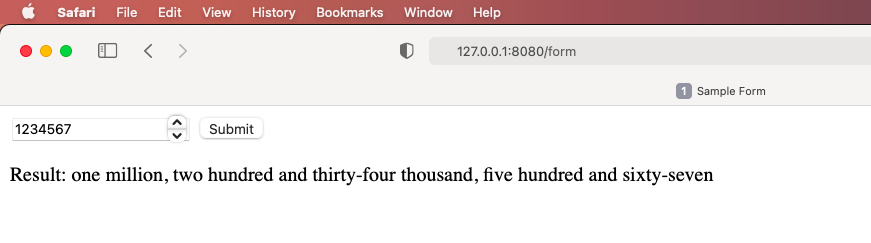

# Serve HTML with FastAPI

A very basic sample repo demonstrating how to use `FastAPI` to serve HTML web apps. 

## quickstart

```
# clone this repo:
git clone https://github.com/anthlis/fastapi-html-basic.git

# install dependencies into a virtual environment
(.env) $ pip install -r requirements.txt

# start the HTML app
(Note to self, do not 'run' in PyCharm as if it's a Flask app!)
(.env) $ uvicorn app.html:app --reload --port 8080
```

Navigate to [127.0.0.1:8080/](http://127.0.0.1:8080/). You should see a 'hello world'.

Then try out [127.0.0.1:8080/form](http://127.0.0.1:8080/form). 
Enter an integer number and see the result spelled out in words below.

Example:


FastAPI auto generates API Swagger documentation too:  
Navigate to [127.0.0.1:8080/docs](http://127.0.0.1:8080/docs) to review and try it out. 


